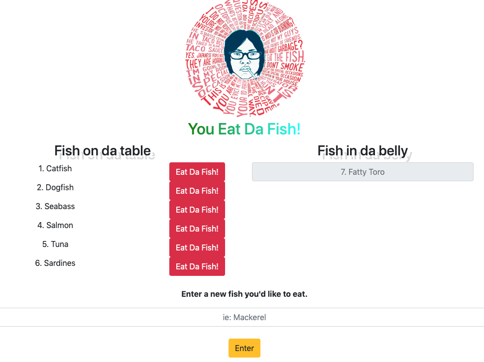

# HW12 | Eat-Da-Fish!

## Link to Live Deployed Page on Heroku
[Heroku Deployed App](https://aqueous-journey-40078.herokuapp.com/fish)

## Installation 
* npm-install for initial download of dependent packages
* node server.js to init server
* navigate to localhost:8080 in web browser to init app

### Screenshot

### Technologies Used
* HTML / CSS
* Node.JS 
* Homebrew ORM
* Express
* Handlebars
* Javascript ES5
* jQuery
* Bootstrap
* MySQL / JawsDB

### Comments
* Hot Dog / Not Hot Dog ? 
